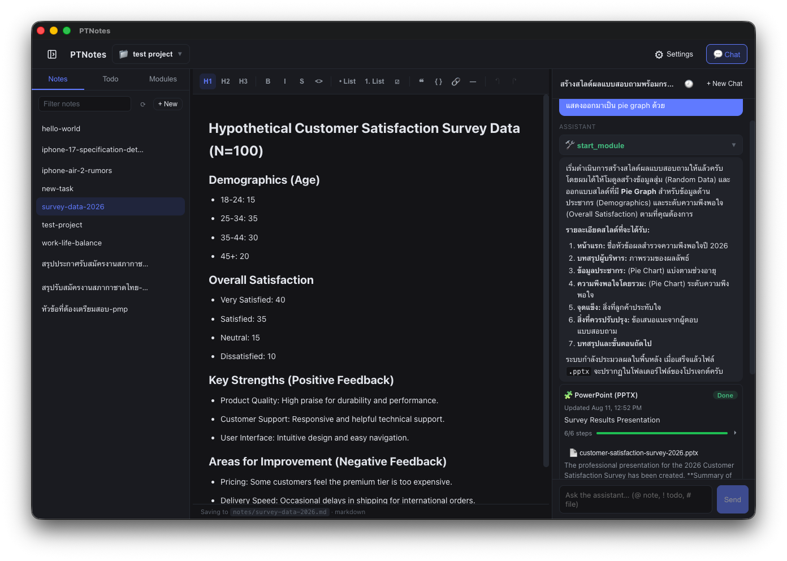
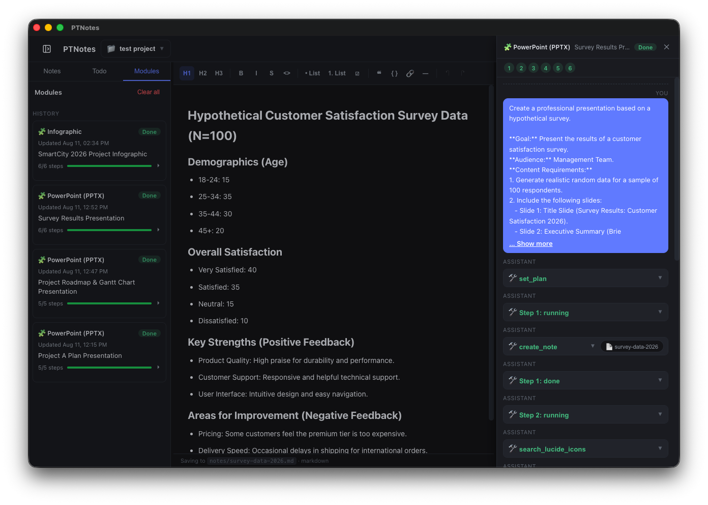

# PTNotes

Write notes, track tasks, plan schedules, and chat with an AI assistant — all organized by project.

## Features

- **Projects** — each project is a folder on disk with its own notes, kanban board, schedules, and chat history. Create, rename, delete, and switch projects from the top bar.
- **Markdown notes** — TipTap WYSIWYG editor with markdown as the source of truth; auto-save ~800ms after edits. Notes are one `.md` file each, with create / rename / delete / refresh.
- **Kanban boards** — a kanban board per project with columns and cards: drag & drop between columns, priorities, due dates (overdue highlighted), labels, story points, assignees, and custom key/value attributes. Add, rename, and delete columns (a board always keeps at least one).
- **Planner** — project schedules in a fourth **Planner** tab: hierarchical tasks with status, owner, duration, plan/actual dates, %complete and notes in a grid editor, plus a **Gantt chart** view (status-bar toggle) with a day-grid timeline, draggable leaf bars (edge handles resize, body drag moves — all day-snapped), day-cell click to set dates on date-less tasks, a right-click bar popup with **Clear Plan**, and a zoom slider. Working-day math computes plan end dates from start + duration (skipping weekends and project holidays — configurable via the **Calendar** button), parents roll up their children's dates, duration, %complete, and status (with a manual-only **On Hold**), and actual dates are never computed. Full undo/redo (toolbar buttons or `⌘Z` / `⇧⌘Z`) in both views.
- **AI chat assistant** — collapsible right-side drawer with real-time streaming replies. Works with any OpenAI-compatible endpoint (OpenAI, OpenRouter, Groq, LM Studio, Ollama, …); base URL, API key, and model configured in-app. Click any image in a response to view it full-size with a fade-in lightbox (Escape or backdrop to close).
- **AI tools** — the assistant can create/update/read/delete/search notes, manage kanban cards (list, create, update, move, delete), read and update project schedules and calendars, search the web (DuckDuckGo, keyless), and read pages locally. Destructive actions (like note or card deletion) require your confirmation.
- **Browser toolset** — optional in-app MCP-powered browser control (Chrome / Edge; toggle in **Settings → Toolsets**). The assistant can navigate pages, click, type, take screenshots, and evaluate JavaScript. Headful by default; headless requires your confirmation. Chat-only (never in modules).
- **Skills** — teach the assistant reusable instructions: named markdown documents (global or per-project) listed in its system prompt and loaded on demand via the `read_skill` tool, with per-skill enable/disable toggles. Managed from **Settings → Skills**.
- **File attachments** — drag & drop files into the chat; supported files (any text file, PDFs, or Excel workbooks, detected by content) are copied locally to the project and can be reused via `#` mentions. The assistant reads them locally with the `read_file` tool.
- **Chat mentions** — type `@` to insert a note, `!` to insert a kanban card, `#` to attach a project file; the AI can link to your notes and kanban cards with clickable `[name](note:name)` / `[name](kanban:name)` links.
- **Slash commands** — type `/` in the chat to open a command + skill picker: `/new` starts a new chat, `/models` opens AI settings, and any **enabled skill** becomes a command (`/skillname my prompt`) that the assistant loads via `read_skill` and applies. **Tab** autocompletes the command, **Enter** runs it.
- **Chat history** — each session is auto-saved to a JSON file; **New Chat** archives the current thread and a history picker lets you reopen, rename, or delete old sessions.
- **Background modules** — the assistant can launch long-running background subagents that plan steps and generate work autonomously. Specialized modules produce deliverables (PPTX/PowerPoint, Word/DOCX, Infographic) and a general-purpose **Subagent (long-run)** handles open-ended research/analysis tasks. The right-side drawer's **Module** button (🧩, top bar) shows live status and per-step progress; click the 💬 button on any run to open a read-only overlay of the module's full conversation (its system prompt, tool calls, and reasoning). The AI decides when to delegate (or you can ask it to "run the subagent"), can start several modules in parallel, tell each what result to return, and `wait_modules` blocks until they all finish and reports their results back. Just ask e.g. _"make a PowerPoint about…"_, _"write a Word document about…"_, _"make an infographic about…"_, or _"do a deep research pass…"_ to start one.
- **Reasoning models** — `<think>` reasoning blocks (e.g. DeepSeek-R1) render in a separate collapsed-by-default bubble; a **Stop** button interrupts a running reply.
- **Missing projects** — projects whose folders were deleted externally still appear in the list (marked in red) and can be recreated in place.
- **Settings** — a category-based **Settings** dialog covers storage, AI provider (with an editable model combobox fed by `GET /models`), modules, skills, and an **About** pane. See [Settings](#settings).

## Tech stack

- Electron + electron-vite + React 19 + TypeScript
- TipTap v3 for the WYSIWYG markdown editor
- `openai` SDK (OpenAI-compatible endpoints) for the AI chat and modules
- `@modelcontextprotocol/sdk` + `playwright-core` for in-process MCP browser toolset (Chrome/Edge)
- `pdf-parse` for extracting text from PDFs (chat files, modules)
- `pptxgenjs` for generating PowerPoint deliverables (modules)
- `docx` for generating Word document deliverables (modules)
- Chart.js + `@napi-rs/canvas` for in-process chart rendering (modules)
- Mermaid + `isomorphic-mermaid` for in-process diagram rendering (modules)
- `@antv/infographic` for in-process infographic rendering (modules)
- `@resvg/resvg-js` for PNG rasterization (charts, diagrams & infographics)
- `@mdi/js` for app's renderer UI icons
- `lucide-static` icon catalog for slide icons (modules)
- `react-markdown` + `remark-gfm` + `remark-breaks` for rendering chat responses
- cheerio for local page reading
- zustand for state management
- electron-builder for packaging
- Plain CSS, no UI framework

## Storage

Data lives under `~/Documents/PTNotes/`:

```
~/Documents/PTNotes/
├── .skills/             (global skills, shared by all projects)
└── <ProjectName>/
    ├── notes/*.md          (one file per note)
    ├── kanban/board.json   (kanban board: columns + cards)
    ├── files/*             (attachments dropped into the chat, module outputs)
    ├── planner/            (project schedules + calendar)
    │   ├── <slug>.json     (one file per schedule)
    │   └── calendar.json   (shared working-day calendar)
    └── .data/              (app-internal data: chat history, module run state, project skills)
        ├── modules/*.json      (module run state + prompts)
        ├── modules/*.chat.json (per-run module conversation transcript)
        ├── skills/*/SKILL.md   (project skills)
        └── chat/*.json         (one file per chat session)
```

On startup, legacy per-project `chat/` and `modules/` folders are automatically migrated into `<project>/.data/`.

The folder on disk is the source of truth, and the project root is configurable via **Settings → Storage** (changing it moves all data). App AI configuration (base URL, API key, model) is stored in Electron's `userData/ai-provider.json`, restricted to the owner's read/write and never bundled into the renderer.

## Settings

The **Settings** page (⚙ icon in the top bar) is organized by category:

- **Storage** — shows the current project root and lets you change where all project data lives (with confirmation). Every project folder, notes, kanban boards, chats, and the project registry are moved to the new location.
- **AI Settings** — connects the assistant to any OpenAI-compatible provider: base URL, API key, and model (editable combobox of available models), plus an optional **PDF upload** toggle for sending PDFs as raw file attachments.
- **Modules** — lists the installed background modules and their enable/disable toggles. Disabling a module hides it from the AI assistant and prevents it from being started; the toggles apply immediately.
- **Toolsets** — lists built-in toolsets (currently: Browser) with enable/disable toggles. Each enabled toolset adds tools to every chat turn — more tokens and higher chance of wrong tool selection. Toolsets are chat-only (never in modules). Designed for future external MCP connections.
- **Skills** — lists global and project skills (name, description) with a per-skill enable/disable toggle; disabled skills are excluded from the assistant. A `⋮` context menu offers **Edit**, **Move to Global/Project skills**, or **Delete** (with confirmation); create/edit happens in a modal (scope, name, description, markdown content). Changes apply immediately.
- **About** — read-only pane showing the app icon, name, version, description + tech stack, and the Electron / Chromium / Node.js runtime versions.

## Screenshots

_Note with AI chat_


_Module run log_


## Commands

- `npm run dev` — development with HMR
- `npm run test` — service / AI tools / chat session / markdown / modules tests
- `npm run typecheck` — TypeScript checks (main + renderer)
- `npm run lint` — ESLint
- `npm run build` — typecheck + electron-vite production build

## Project Setup

### Install

```bash
$ npm install
```

### Development

```bash
$ npm run dev
```

### Build

```bash
# For windows
$ npm run build:win

# For macOS (arm64: DMG + zip)
$ npm run build:mac

# For Linux
$ npm run build:linux
```

Packaged artifacts are written to `dist/` (e.g. `dist/ptnotes-0.5.0.dmg`).
